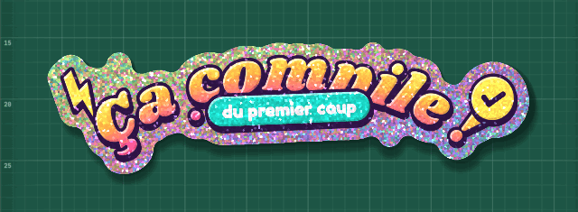
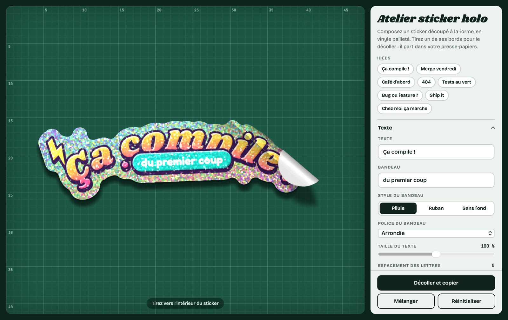
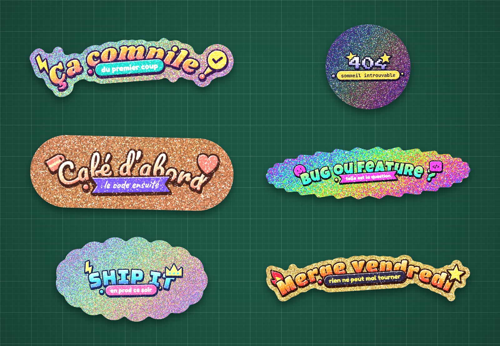

<h1 align="center">Atelier sticker holo</h1>

<p align="center">
  <strong>Des stickers holographiques à paillettes, qu'on décolle du bout de la souris.</strong><br>
  App macOS et version web.
</p>

<p align="center">
  
</p>

On écrit son texte, on choisit la police, les couleurs, la matière et la forme de découpe, et le sticker se fabrique sous les yeux : encre en relief, paillettes qui accrochent la lumière quand il bouge, découpe qui suit les lettres. Quand il est prêt, on attrape un bord et on tire. Une fois décollé, il est dans le presse-papiers en PNG transparent, prêt à coller dans Slack, Keynote, Figma ou un mail.



## Ce qu'on peut régler

- **Texte** : texte principal et bandeau, bandeau en pilule, en ruban ou sans fond, tout en majuscules si on veut.
- **Lettrage et relief** : 12 polices d'affiche (rétro, bulle, arcade, cartoon, script, pinceau, western, pixel, horreur, enseigne, épais, chewy) et 4 polices pour le bandeau, taille, espacement des lettres, texte en arc vers le haut ou vers le bas, épaisseur du contour, profondeur 3D.
- **Couleurs** : 10 palettes (Soleil, Lagon, Bonbon, Chrome, Menthe, Lave, Nuit, Pastel, Néon, Pêche), puis chacune des 8 couleurs à la main : le dégradé des lettres en trois tons, le contour, le bandeau, son texte et les décorations. Les lettres peuvent être en dégradé, unies, en paillettes nacrées, ou évidées pour laisser voir la matière du sticker.
- **Matière** : holo, or, argent, or rose, cuivre, opale, galaxie, prisme, vinyle blanc ou vinyle clair, avec les reflets, la taille des paillettes et le scintillement.
- **Découpe** : à la forme des lettres, arrondie, en capsule, en rectangle, en ovale, en cercle, en éclat ou en nuage, avec une marge réglable.
- **Décorations** : de chaque côté du texte, un éclair, une pastille « validé », un cœur, une étoile, une couronne, une flamme, une tasse de café, une balise `</>`, un smiley ou n'importe quel emoji, et des confettis autour du bandeau.
- **Plan de travail** : tapis de découpe vert ou bleu, liège, alu ou nuit, et un léger mouvement au repos.

Huit idées sont prêtes à l'emploi (Ça compile !, Merge vendredi, Café d'abord, 404, Tests au vert, Bug ou feature ?, Ship it, Chez moi ça marche), Mélanger tire au hasard un nouveau style (palette, police, matière, découpe…) et Mes stickers garde les créations pour plus tard. Une petite fiche donne le format du sticker (7,5 cm de large), son support et sa découpe.

<p align="center">
  
</p>

## Installer l'app Mac

Il faut macOS 12 ou plus récent et les outils de développement d'Apple (`xcode-select --install` si `swiftc` est introuvable).

```bash
git clone https://github.com/AyoubO22/atelier-sticker-holo.git
cd atelier-sticker-holo
./build.sh
```

`build.sh` dessine l'icône, télécharge les polices pour que l'app fonctionne hors ligne, compile, signe l'app localement et l'installe dans `~/Applications/Atelier sticker holo.app`, sans droits administrateur. Sans réseau au moment de la compilation, l'app se construit quand même et charge ses polices en ligne au lancement.

Dans l'app, les réglages et Mes stickers sont gardés d'un lancement à l'autre, et le sticker peut aussi être enregistré en PNG.

| Raccourci | Action |
| --- | --- |
| ⇧⌘C | Décoller le sticker et le copier |
| ⌘S | Enregistrer en PNG… |
| ⌘K | Garder dans Mes stickers |
| ⌘R | Mélanger |
| ⇧⌘R | Réinitialiser |
| ⌥⌘R | Recharger l'atelier |
| ⌃⌘F | Plein écran |

## Version web

[`web/index.html`](web/index.html) contient tout l'atelier dans une seule page : une fois le dépôt cloné, il suffit de l'ouvrir dans un navigateur récent (Safari, Chrome, Edge ou Firefox). Les polices viennent de Google Fonts, il faut donc être en ligne. Mes stickers est gardé dans le navigateur. Sans WebGL, l'atelier passe à un rendu simplifié.

## Comment ça marche

L'atelier tient dans un seul fichier, `Resources/atelier.html`, sans bibliothèque.

- **L'encre** est dessinée en Canvas 2D : chaque lettre est posée sur l'arc, puis viennent le contour, le relief 3D, les reflets et les ombres.
- **La découpe** part de la silhouette de l'encre. Une transformée de distance euclidienne exacte (algorithme de Felzenszwalb et Huttenlocher) donne un champ de distance signé : la marge est un seuil sur ce champ, une fermeture morphologique adoucit les creux et les trous intérieurs sont bouchés. Le même champ sert au bord blanc, à l'ombre et aux normales du décollage.
- **Les paillettes** sont un shader WebGL : des cellules de Voronoï, chacune inclinée au hasard, renvoient un reflet très serré et une couleur irisée qui dépend de l'angle entre la lumière et le regard. Le sticker s'incline avec la souris, alors elles scintillent.
- **Le décollage** plie le sticker autour d'un cylindre qui suit le pointeur. Pour chaque pixel, le shader décide s'il est encore collé, dans le rouleau ou sur le rabat retourné, qui montre le dos blanc de l'adhésif, et dessine l'ombre du rabat. Passé 62 % du sticker, il suffit de lâcher : il part tout seul.
- **Le PNG** est rendu à plat dans un framebuffer hors écran, relu avec `readPixels` puis écrit avec sa transparence. Dans le navigateur, il passe par `navigator.clipboard` ; dans l'app, un `WKScriptMessageHandler` le confie à `NSPasteboard` ou à un panneau d'enregistrement.

L'app Mac est une fenêtre AppKit avec un `WKWebView`, écrite en Swift sans projet Xcode : `build.sh` appelle directement `swiftc`.

## Organisation

```text
Resources/atelier.html   l'atelier : HTML, CSS et JavaScript (WebGL)
Sources/main.swift       l'app : fenêtre, menus, pont entre la page et macOS
Sources/Icon.swift       dessine l'icône de l'app
Info.plist               description de l'app
build.sh                 compile, signe et installe l'app, régénère web/index.html
web/index.html           la version navigateur, générée par build.sh
Tools/Snapshot.swift     refait les images de ce README
docs/                    ces images
```

Après une modification de `Resources/atelier.html`, relancer `./build.sh` : l'app et `web/index.html` sont mis à jour ensemble. Les messages de la page (erreurs, démarrage) arrivent dans `~/Library/Logs/AtelierStickerHolo.log`.

Pour refaire les images de ce README à partir de l'app compilée :

```bash
xcrun swiftc -O -swift-version 5 Tools/Snapshot.swift -o build/snapshot
./build/snapshot "build/Atelier sticker holo.app/Contents/Resources/atelier.html" docs
```

## Polices

Bagel Fat One, Bricolage Grotesque, Bungee, Caveat, Chewy, Creepster, Fredoka, JetBrains Mono, Knewave, Luckiest Guy, Pacifico, Press Start 2P, Rammetto One, Rye, Shrikhand et Titan One, distribuées par Google Fonts sous licences libres. Elles ne sont pas dans le dépôt : `build.sh` les télécharge dans l'app au moment de la compilation.
